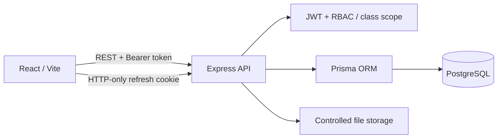

# Teacher Planning Platform

[](https://github.com/MeLlamoGer/teacher-planning-platform/actions/workflows/ci.yml)

A full-stack prototype for primary-school lesson planning, curriculum alignment and role-based collaboration.

The application models a school workflow rather than a generic CRUD demo: teachers plan against structured curriculum content, administrators manage classes/users, substitutes receive temporary access, and student-specific support/adaptations can be represented.

> **Portfolio / privacy note**
> The public version is anonymized. Demo student records are synthetic and no real student data, school credentials or private deployment secrets are included.

## Review in 60 seconds

If you're reviewing this as an engineering portfolio, the strongest parts are:

1. **[Prisma domain model](planificador-backend/prisma/schema.prisma)** — classes, curriculum, lesson plans, substitute access, student support and adaptations.
2. **[Authorization model](docs/security-model.md)** — role + class scope + lesson-plan ownership, including hardening found during review.
3. **[Lesson-plan service](planificador-backend/src/modules/planificaciones/planificaciones.service.ts)** — access checks, curriculum-integrity validation and transactional relation updates.
4. **[Domain rationale](docs/domain-model.md)** — why temporary substitute access and student support are modeled separately.
5. **[API map](docs/api.md)** — concise route-level overview.

## Stack

### Frontend
- React 19 + TypeScript + Vite
- React Router
- TanStack Query
- Zustand
- Zod
- FullCalendar
- Recharts

### Backend
- Node.js + Express + TypeScript
- Prisma ORM + PostgreSQL
- JWT access/refresh authentication
- role- and class-scoped authorization
- Zod request validation
- Multer + controlled local file storage

## Main capabilities represented in the public snapshot

- short-lived access tokens + HTTP-only refresh cookies;
- roles for teachers, administrators, secretaries and substitute teachers;
- academic-year and class management;
- time-bounded substitute-teacher access;
- curriculum spaces, units, competencies and content blocks;
- lesson-plan creation/editing/bulk scheduling logic;
- class-scoped attachments and comments;
- student support needs and plan-specific adaptations;
- coverage reporting;
- a trimmed React UI for calendar, students, reports and administration views.

## Architecture



The backend keeps authorization checks close to the domain. A role alone is not enough: teachers are scoped to assigned classes, substitute teachers receive time-bounded class access, and nested resources such as attachments/adaptations inherit the class scope of their parent records.

## Review notes

The code was reviewed specifically for publication. That review found and fixed several early-stage authorization edge cases, including:

- class filters being overwritten by year filters;
- lesson-plan creation not re-checking class assignment;
- nested attachment/student/adaptation routes trusting resource IDs too much;
- direct class-detail endpoints exposing more than the caller's scope;
- access tokens being persisted in browser storage instead of restored from the HTTP-only refresh cookie.

Those fixes are part of the portfolio story rather than hidden history: code review and security hardening are engineering work.

See:

- [Domain model](docs/domain-model.md)
- [Security model](docs/security-model.md)
- [API surface](docs/api.md)
- [ADR: class-scoped authorization](docs/adr/001-class-scoped-authorization.md)
- [ADR: curated public snapshot](docs/adr/002-curated-public-snapshot.md)
- [Public snapshot scope](docs/public-snapshot.md)

## Data model highlights

The Prisma schema includes relationships for:

- users ↔ classes;
- temporary substitute access;
- curriculum spaces / units / competencies / content;
- lesson plans and selected curriculum items;
- students, support needs and adaptations;
- attachments and comments.

## Local backend setup

```bash
docker compose up -d

cd planificador-backend
cp .env.example .env

npm install
npm run db:push
npm run db:seed
npm test
npm run dev
```

The public snapshot intentionally does not publish historical development migrations, because the schema evolved during prototyping. `db:push` creates the current portfolio schema directly from Prisma. The seed requires `SEED_ADMIN_EMAIL` and `SEED_ADMIN_PASSWORD` from the environment and creates only synthetic portfolio data.

## Public frontend

The original prototype contains more work-in-progress UI than is useful in a public code review. The public frontend is deliberately trimmed to a smaller read-oriented portfolio surface around the same API/domain model.

```bash
cd planificador-frontend
npm install
npm run dev
```

Vite proxies `/api` requests to `http://localhost:3000`.

## Current status

This is an **early-stage prototype**, not a finished commercial product. The backend/domain model is the strongest part of the project; UI, broader automated test coverage, audit history and deployment infrastructure are still areas for improvement.

## Next improvements

- authorization integration tests beyond the current unit-test baseline;
- production object storage for attachments;
- audit logging for sensitive school operations;
- deployment configuration;
- additional reporting and UI polish.
