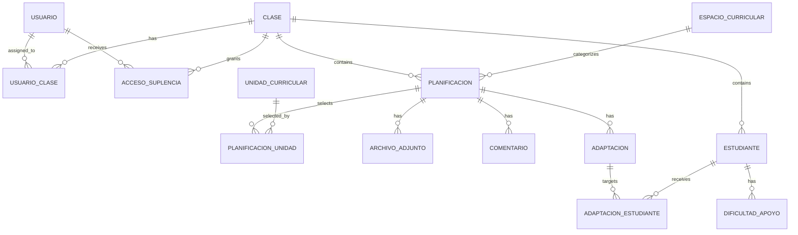

# Domain model

The project is intentionally modeled around a real school-planning workflow rather than around generic CRUD entities.

## Core relationships

## Why temporary substitute access is its own entity

A substitute teacher should not receive a permanent class assignment simply because they cover a class for a few days. `AccesoTemporalSuplencia` therefore stores:

- substitute user;
- class;
- start/end dates;
- creator;
- active status;
- optional reason.

Authorization checks evaluate that date window at request time.

## Curriculum structure

The curriculum is split into:

1. curricular spaces;
2. curricular units;
3. specific competencies;
4. content blocks;
5. individual content items.

A lesson plan references the selected curriculum elements rather than copying their text into one free-form field. That makes later coverage reporting possible.

## Student support

Support needs are stored independently from lesson-plan adaptations:

- `DificultadApoyo` describes an ongoing support need associated with a student and optionally a curriculum area/unit.
- `Adaptacion` describes a concrete adaptation for one lesson plan and may target multiple students.

This distinction keeps persistent student context separate from one-off instructional decisions.
